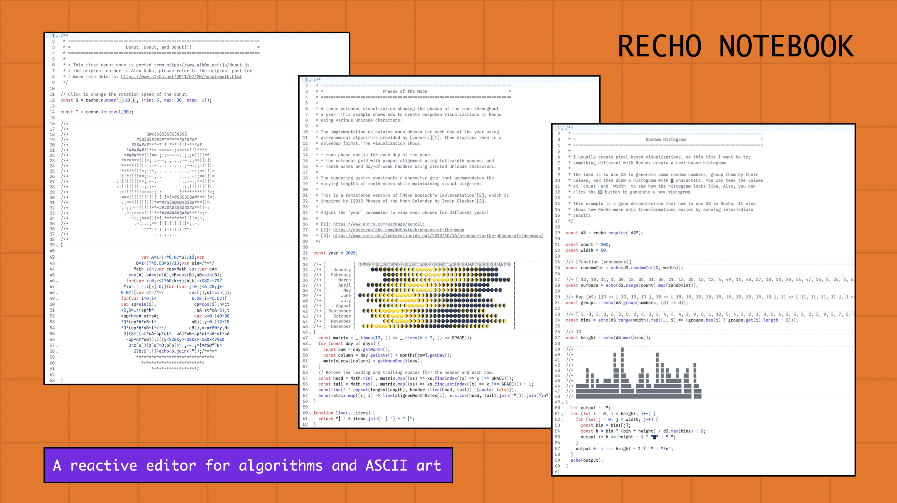

# Recho Notebook



> We want to live in the editor forever. — [Luyu Cheng](https://luyu.computer/)

[**Recho Notebook**](https://recho.dev/notebook) is a free, [open-source](/LICENCE), reactive editor for algorithms and ASCII art. It introduces a _plain code format_ for notebooks — echoing output inline as comments for live, in-situ coding with instant feedback. Built on vanilla JavaScript and the reactive model of [Observable Notebook Kit](https://observablehq.com/notebook-kit/), Recho Notebook lets developers, artists, and learners explore algorithms and ASCII art interactively.

- [Editor](https://recho.dev/notebook) 📝 - The quickest way to get started with Recho Notebook.
- [Announcement](https://medium.com/@subairui/a-lighter-way-to-code-with-creativity-8c0ac739aa6f) 📢 - Read our initial release story to discovery the vision behind Recho Notebook.
- [Documentation](https://recho.dev/notebook/docs/introduction) 📚 - Learn how to use Recho Notebook with our comprehensive guides.
- [Examples](https://recho.dev/notebook/examples) 🖼️ - See what you can create and draw some inspiration!
- [Sharing](/CONTRIBUTING.md#sharing-examples) 🎨 - Follow the instructions to open a [pull request](https://github.com/recho-dev/notebook/new/main/app/examples) to share your sketches!
- [Contributing](/CONTRIBUTING.md) 🙏 - We have [a bunch of things](https://github.com/recho-dev/notebook/issues) that we would like you to help us build together!

## Core Idea 🧠

Unlike typical notebooks (like Jupyter or Observable), Recho Notebook treats **code and its output as a single, continuous document**. When you write code, **the output appears inline — as a comment right above your code**.

```js
//➜ "dog"
const text = echo("dog");

//➜ [ "g", "o", "d" ]
const words = echo(text.split(""));

//➜ "god"
echo(words.reverse().join(""));
```

If you modify the code, the echoed output updates immediately. So instead of switching between “code cells” and “output cells,” your entire notebook feels like a living text file that responds to you.

## Design Philosophy 💡

The name **Recho** comes from “Reactive Echo” — every expression echoes its result, instantly. It’s meant to capture the feedback loop between code and creator — seeing how every small change ripples through your work.

Recho Notebook is both a tool and a statement — it imagines what happens if we strip away complex GUIs and treat code itself as the canvas.

It’s light, artistic, and reactive — blending ideas from creative coding, literate programming, and live performance.

## Example Use Cases 🖼️

- Teaching/learning basic algorithms with immediate text/visual feedback.
- Creating text-based animations to experience the simplicity and clarity in ASCII art.
- Exploring code minimalism — finding beauty in code and its textual output.

## Why Recho Notebook 🪶

We’ve always loved [Observable Notebooks](https://observablehq.com/). To make notebooks more portable, we built [Markdown Genji](https://genji-md.dev/), extending Markdown with live code features. Later, [Observable Framework](https://observablehq.com/framework) and [Observable Notebook Kit](https://observablehq.com/notebook-kit/) explored similar ideas, which made us wonder — could a notebook exist as a plain code file?

At the same time, we wanted to make coding more accessible and playful. Inspired by the [p5.js web editor](https://editor.p5js.org/), we realized **well-designed language doesn’t necessarily make coding more accessible — the environment does**. So we asked — what if we focused on algorithms instead of graphics, using ASCII art when visuals are needed?

That’s how Recho Notebook began — **[a lighter way to code with creativity](https://medium.com/@subairui/a-lighter-way-to-code-with-creativity-8c0ac739aa6f)**.

## What's Next 🔥

Recho Notebook is in beta — and open source! 🎉 Try it out on our [website](https://recho.dev/notebook) or explore the code on [GitHub](https://github.com/recho-dev/notebook). We’d love your thoughts, comments, or suggestions. Want to contribute? Here’s where you can help:

- **Sharing Examples** – [text analysis](https://recho.dev/notebook/examples/word-count), [ASCII art](https://recho.dev/notebook/examples/moon-sundial), [data viz](https://recho.dev/notebook/examples/phases-of-the-moon), [graphics](https://recho.dev/notebook/examples/cg-text-based-shaders), [concrete poetry](https://recho.dev/notebook/examples/fire!), or demos with [D3](https://d3js.org/), [Tone](https://tonejs.github.io/), [ml5](https://ml5js.org/)… anything! One example is enough.
- **Polyglot Programming** – Recho Notebook is JavaScript-first but open to any language that compiles to JavaScript — [Python](https://www.python.org/), [Rust](https://www.rust-lang.org/), [MLscript](https://github.com/hkust-taco/mlscript), [wenyan‑lang](https://wy-lang.org/)… your playground.
- **LLM Experiments** – What if LLMs could "see" both the input and the output?

We’re also improving:

- **Editing & Workflow** – Reruns, formatting, smoother editing.
- **Visuals** – Dark theme, ANSI codes, more expressive output.
- **Interactivity** – Mouse, keyboard, and more input support.

Cloud storage is coming, but for now, keep it simple — and keep the ideas coming! 🚀

## License 📄

ISC © [Recho Notebook](https://github.com/recho-dev)
